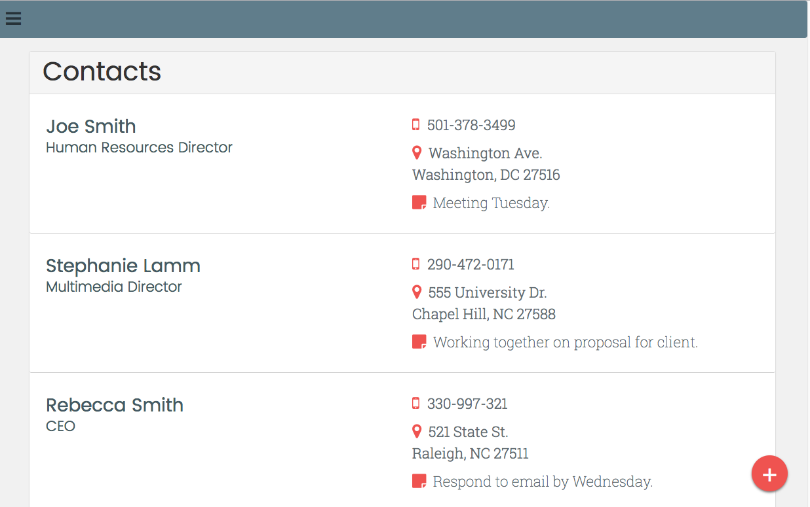

# contact-manager-php
A php and mySQL-based contact manager for the web.

## To install:
##### 1. Clone repository. git clone <code> https://github.com/stephanielamm/contact-manager-php.git </code>

##### 2. Set up a local Apache and SQL server on port :8080. The database name is 'contact_manager'.
##### 3. Open http://localhost:8080/

## Here's what you should see:

